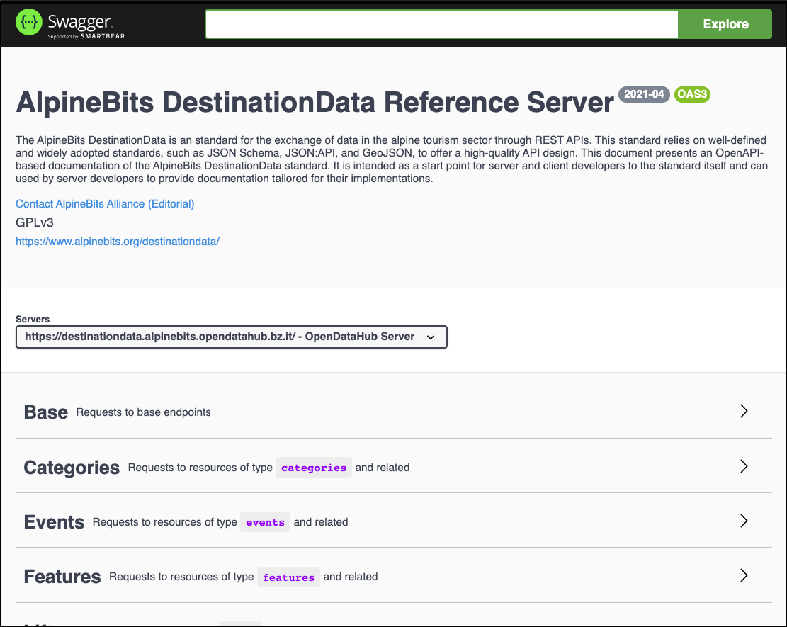

<!-- DO NOT MODIFY THIS FILE! - Auto generated copy of index.md -->

# ODH AlpineBits DestinationData - OpenAPI

Welcome to the OpenAPI specification of the ODH AlpineBits DestinationData.

The ODH AlpineBits DestinationData is a REST API that exposes real open data from the [OpenDataHub](https://opendatahub.bz.it/) access point in conformance to the [AlpineBits DestinationData](https://www.alpinebits.org/destinationdata/) standard.
ODH AlpineBits DestinationData is a great place for developers to consume data on the alpine tourism sector and boost their solutions and learn the AlpineBits DestinationData standard for the exchange of data tourism data.

The OpenAPI specification in this repository documents the reference server hosted [here](https://github.com/noi-techpark/odh-alpinebits-destination-data-server).
To access this specification as a live documentation, please visit our [Swagger page](https://claudenirmf.github.io/odh-alpinebits-destination-data-swagger/swagger).


[](https://claudenirmf.github.io/odh-alpinebits-destination-data-swagger/swagger)

This specification is built on top of the official [AlpineBits DestinationData OpenAPI specification](https://gitlab.com/alpinebits/destinationdata/tools).

## Development

All OpenAPI files are contained in a NodeJs project in the folder `/openapi`. The whole specification is split into multiple YAML files, but the entry point is the file `/openapi/src/index.yml`. To validate or host the specification locally as a Swagger page in a Docker container, you can use the commands bellow (they must be ran from the `/openapi` folder).

```bash
npm install       # only once
npm run validate  # validates all files reachable from index.yml
npm run host      # accessible at localhost:3000
```

Since some tools supporting OpenAPI cannot handle a specification split into multiple files, you can bundle them into a single file running the following command.

```bash
npm run bundle    # generates the files specification.yml and specification.json
```

The rest of this repository consists of a static webpage managed as a [Jekyll](https://jekyllrb.com/) project and deployed through [GitHub Pages](https://pages.github.com/).
Jekyll generates static pages from `index.md` files in each folder (some exclude, see `_config.yml`).
The Swagger documentation, however, is an exception and is clone of the [swagger-ui](https://github.com/swagger-api/swagger-ui) project.
The deployment workflow of this project to GitHub Pages is available in the folder `/.github/workflows/github-actions.yml`.
To learn more about the projects and technologies used, please here to their our documentations.
